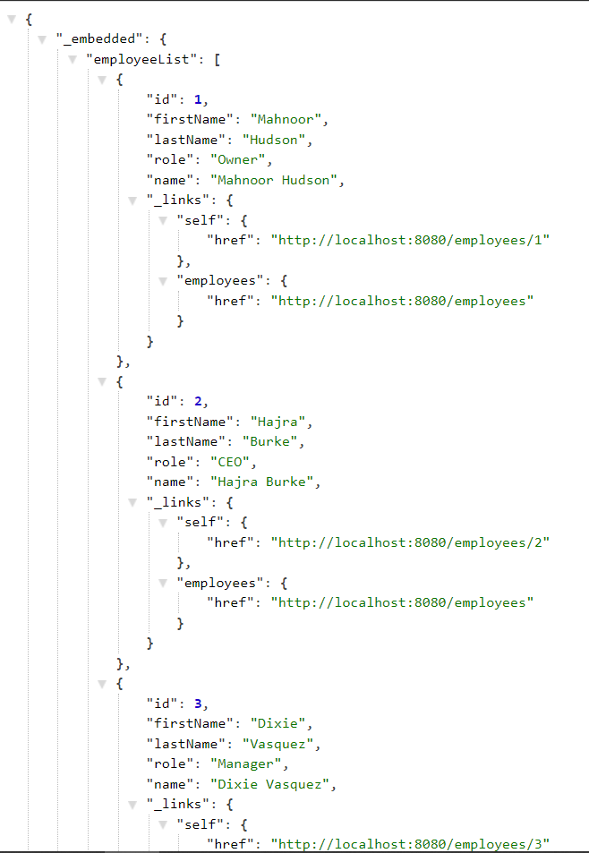

# payroll api
 
A RESTful web service to manage employee payroll information.
Click [here](https://spring.io/guides/tutorials/rest/) to go to the tutorial page of this project 

### project setup
```
> make Eclipse, netBean or any IDE of your choice is installed
> download and extract the project
> import the project into your IDE
> build the project
> go to src/main/java/jack/payroll/PayrollApplication.java and run the application
```

### end points
```
> If you were to run this on a local machine, the end points will start with localhost:8080
```


> * End points for HTTP GET requests (retrieve existing records)
>localhost:8080/employees
    

>localhost:8080/employees/{id} (In this case the id is 5)
    

>localhost:8080/orders
    

>localhost:8080/orders/{id} (In this case id the is 5)
    


> * End points for HTTP POST requests (create new records)

>localhost:8080/employees

>localhost:8080/orders

> * End points for HTTP PUT requests (update records with corresponding id)

>localhost:8080/employees/{id}
>localhost:8080/orders/{id}
>localhost:8080/orders/{id}/complete (set the status of the selected order to be completed)
>localhost:8080/orders/{id}/cancel (set the status of the selected order to be canceled)

> * End points for HTTP Delete requests (delete records with corresponding id)
localhost:8080/employees/{id}

localhost:8080/orders/{id}
